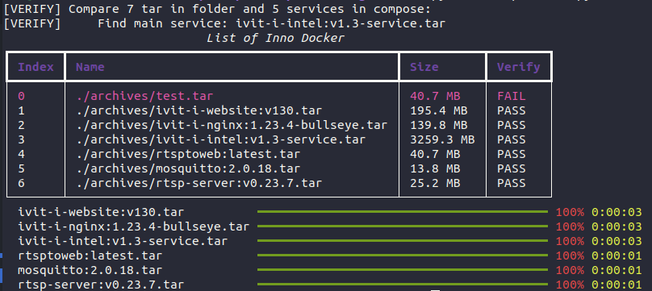

# DIH: Docker Image Handler
Help to save and load docker image.


---
[](https://codecov.io/gh/p513817/dih)

# Requirements
* `python 3.10`
* [virtualenv](./assets/install-venv.md)
* `mkvirtualenv dih`
* `pip install -r requirements.txt`

# Usage
* Load Docker Tarball Files:
    ```bash
    python3 src/main.py load -f ./archives/ -c ./sample-compose.yml 
    ```
* Save Docker Image into specific folder
    ```bash
    python3 src/main.py save -f ./archives/ -inc innodisk -exc none
    ```

# Testing
[Test Report](junit/test-results.xml)
* `pytest -v`
* `pytest --doctest-modules --junitxml=junit/test-results.xml --cov=. --cov-report=xml --cov-report=html`

# Distribute
```bash
pip3 install pyinstaller==6.3.0
pyinstaller -F src/main.py -n DIH
```
