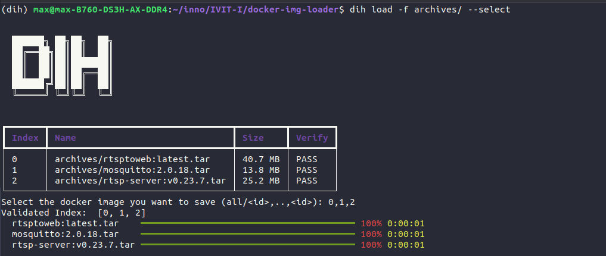

# DIH: Docker Image Handler
Help to save and load docker image.



# Usage
* Install module
    ```bash
    pip install dih
    ```
* Load docker image with specific folder or file
    ```bash
    dih load -f ./archives
    ```
* Load docker image with manual selection
    ```bash
    python3 src/main.py load -f ./archives --select
    ```
* Load docker image with specific folder and verify with compose file.
    ```bash
    dih load -f ./archives -c <path/to/compose>
    ```
* Save docker image into tarball file.
    ```bash
    dih save -f ./archives
    # Select the index of the docker images
    ```
* Save specific docker image into tarball file.
    ```bash
    # dih save -f ./archives -inc <include keys> -exc <exclude keys>
    dih save -f ./archives -inc innodisk -exc none
    ```

# Development
For developer.

## Requirements
* `python 3.10`
* [Virtualenv, VirtualenvWrapper](./assets/install-venv.md)
* `mkvirtualenv dih`
* `pip install -r requirements.txt`

## Testing
```bash
pytest -v
pytest --doctest-modules --junitxml=junit/test-results.xml --cov=. --cov-report=xml --cov-report=html
```

## Distribute
```bash
python setup.py sdist bdist_wheel
pip3 install --force-reinstall dist/dih-*.whl
```