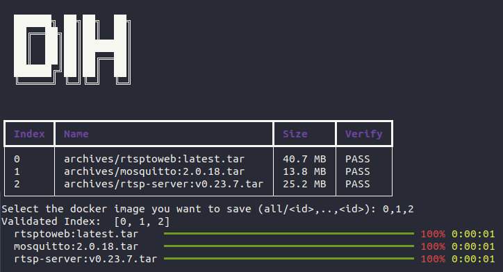

<div align="center">


# DIH: Docker Image Handler
**A tool to save and load the docker image tarball file.**


</div>

## Requirements
* `python >3.8`

## Install module with PyPI
```bash
pip install dih
```

## Load docker image with tarball file
* Load docker image with specific folder or file
    ```bash
    dih load -f ./archives
    ```
* Load docker image with manual selection
    ```bash
    python3 src/main.py load -f ./archives --select
    ```
* Load docker image with specific folder and verify with compose file.
    ```bash
    dih load -f ./archives -c <path/to/compose>
    ```
## Save docker image with tarball file
* Save docker image into tarball file.
    ```bash
    dih save -f ./archives
    # Select the index of the docker images
    ```
* Save specific docker image into tarball file.
    ```bash
    # dih save -f ./archives -inc <include keys> -exc <exclude keys>
    dih save -f ./archives -inc innodisk -exc none
    ```

# For Developer
## Requirements
* `python 3.10`
* [Virtualenv, VirtualenvWrapper](./assets/install-venv.md)
* `mkvirtualenv dih`
* `pip install -r requirements.txt`

## Testing
```bash
pytest -v
pytest --doctest-modules --junitxml=junit/test-results.xml --cov=. --cov-report=xml --cov-report=html
```

## Distribute
* Current
    ```bash
    python3 -m pip install --upgrade build
    sudo apt install python3.10-venv
    python3 -m build
    twine upload dist/*
    ```
* Legacy
    ```bash
    python setup.py sdist bdist_wheel
    pip3 install --force-reinstall dist/dih-*.whl
    twine upload dist/*
    ```
